# 基于Spark的外卖数据分析系统设计与实现

> 公开脱敏版：保留论文正文与技术插图；学校模板、页眉页脚、校徽、身份元数据不进入公开文件，含个人资料或凭据的截图已隐藏。

目 录

## 绪论

### 选题背景

随着移动互联网技术的飞速发展和智能终端的广泛普及，O2O（Online To Offline）模式深刻改变了人们的生活方式，其中外卖服务已成为城市居民日常生活中不可或缺的一部分。美团、饿了么等外卖平台在过去几年中经历了爆发式增长，连接了数以百万计的餐饮商户和庞大的消费者群体，由此产生了海量的交易数据、用户评价及菜品信息。这些数据不仅记录了餐饮行业的实时动态，更蕴含着极具价值的市场规律、用户偏好及消费趋势。

然而，面对如此庞大且杂乱的数据资源，大多数中小型餐饮商家仍依赖经验进行决策，缺乏有效的数据分析工具来指导经营，导致在菜品定价、营销推广及库存管理等方面存在盲目性。同时，对于消费者而言，如何在众多的商户和菜品中快速做出最优选择也是一大难题。传统的单一数据报表已难以满足日益复杂的分析需求，亟需引入大数据技术对这些非结构化和半结构化数据进行深度挖掘。因此，开发一套基于Spark的高效外卖数据分析系统，通过对海量外卖数据的采集、清洗、存储与可视化分析，不仅能帮助商家实现精细化运营，也能为行业监管和市场研究提供科学依据，具有重要的现实意义和应用价值。

### 选题目的与意义

本课题旨在设计并实现一套基于Spark的外卖数据分析系统，通过集成网络爬虫、大数据存储与分布式计算技术，构建一个从数据采集到可视化展示的完整数据应用闭环。具体而言，系统利用Jsoup爬取美团外卖的商户、菜品及销量数据，结合MySQL进行持久化存储，并引入Apache Spark框架对海量业务数据进行高效处理，最终通过Vue.js前端与ECharts图表库直观呈现商户销量排名、热门菜品挖掘、价格分布区间等关键指标。

从现实意义来看，本系统的开发具有双重价值。对于餐饮商户而言，通过对销售数据、用户评价及竞品信息的深度分析，能够帮助商家精准把握市场动态与用户口味偏好，从而优化菜品结构、制定合理的定价策略并改进服务质量，实现由经验驱动向数据驱动的精细化运营转型。对于外卖平台与监管部门，系统提供的数据可视化报表有助于监控区域内的餐饮消费趋势与异常交易行为，为行业规范与资源调配提供决策支持。此外，本课题还将大数据技术应用于具体的电商场景，验证了Spark在处理中等规模非结构化数据方面的高效性，对于探索大数据技术在传统服务行业的落地应用具有一定的参考借鉴意义。

### 国内外发展现状

在外卖数据分析领域，国内外均呈现出大数据技术与商业智能（BI）深度融合的趋势。国外方面，Grubhub、Uber Eats等主流外卖平台较早建立了完善的数据仓库与实时分析系统，利用Hadoop生态与Spark计算框架对海量订单流进行实时处理，实现了动态定价、配送路径优化及用户个性化推荐。同时，各类第三方数据服务商如Tableau、Looker等也提供了强大的可视化分析工具，辅助餐饮企业进行精细化运营，但在针对特定区域中小商户的低成本、轻量级分析方案上仍有空白。

国内方面，随着美团、饿了么双寡头格局的形成，各大平台自身已具备极强的数据分析能力，广泛应用Spark、Flink等流批一体计算引擎进行千亿级数据的挖掘。然而，这些平台内部的高级分析功能往往仅对大型连锁品牌开放或收费高昂，普通商户难以获取深度的经营洞察。目前，虽然已有部分基于Python爬虫的数据采集工具出现，但大多功能单一，缺乏从数据采集（Jsoup）、存储（MySQL）、分布式计算（Spark）到前端可视化（Vue+ECharts）的一体化解决方案。现有的开源项目多侧重于单一技术点的实现，少有能够整合SpringBoot后端与Spark大数据分析能力的完整系统，难以满足中小商户对多维度、低门槛数据分析服务的迫切需求。

### 章节内容安排

1. 绪论

本章主要介绍外卖数据分析系统的研究背景、研究意义以及国内外相关研究现状，分析外卖行业数据特点与大数据技术的应用价值，明确本文的研究内容、技术路线和整体结构安排。

2. 关键技术分析

本章对系统中涉及的关键技术进行分析，重点介绍 Apache Spark 的大数据处理机制，以及 Spring Boot、Vue、MySQL 和爬虫技术的基本原理与应用场景，为系统实现提供技术支撑。

3. 系统分析

本章从业务需求和系统需求两个层面对外卖数据分析系统进行分析，明确系统的功能需求、性能需求及数据处理流程，并对外卖数据的来源、类型及分析指标进行详细说明。

4. 系统设计

本章在系统分析的基础上，完成系统总体架构设计和功能模块设计，采用前后端分离架构，设计数据采集、数据处理、数据分析及数据可视化等模块，并规划数据库结构。

5. 系统实现

本章详细介绍系统各功能模块的具体实现过程，利用爬虫采集外卖数据，通过 Spark 对数据进行清洗和分析，后端采用 Spring Boot 提供接口，前端使用 Vue 实现数据展示。

6. 系统测试

本章对外卖数据分析系统进行功能测试和性能测试，通过测试验证系统各模块功能的正确性和稳定性，分析测试结果，确保系统能够满足设计要求并正常运行。

7. 结论

本章对全文工作进行总结，回顾基于 Spark 的外卖数据分析系统的设计与实现过程，分析系统的实际应用效果，并对系统存在的不足及未来优化方向进行展望。

## 关键技术介绍

### Spring Boot

Spring Boot 是由 Pivotal 团队开发的轻量级 Java 框架，旨在简化 Spring 应用的初始搭建和开发过程。它遵循“约定优于配置”的设计原则，内置了 Tomcat 等 Web 容器，通过自动配置机制消除了繁琐的 XML 配置，使开发者能够快速构建独立的、生产级别的微服务应用。其丰富的 Starter 依赖管理，极大地降低了项目集成第三方库的复杂度，提高了开发效率。

在本外卖数据分析系统中，Spring Boot 作为后端核心框架，发挥着至关重要的作用。它不仅承担了业务逻辑的处理与 RESTful API 接口的对外发布，还负责无缝整合 MyBatis 持久层框架以实现 MySQL 数据的读写，以及集成 Apache Spark 组件进行大规模数据分析任务的调度。通过 Spring Boot 的自动装配特性，系统能够高效响应 Vue 前端的数据请求，确保了爬虫数据采集、清洗入库到前端可视化展示全流程的稳定运行。

### Vue

Vue.js 是一套用于构建用户界面的渐进式 JavaScript 框架，采用 MVVM（Model-View-ViewModel）架构模式，专注于视图层。它以其轻量级、响应式的数据绑定和组件化开发而闻名，核心库只关注视图层，易于上手且能与其他库或现有项目整合。Vue 通过虚拟 DOM 技术实现了高效的页面渲染，同时配合其丰富的生态系统（如 Vue Router、Vuex），能够快速搭建复杂的单页应用（SPA），提升用户体验与开发效率。

在本外卖数据分析系统中，Vue.js 承担了前端页面的构建与交互逻辑实现。系统利用 Vue 的组件化特性，将商户销量排名、热门菜品挖掘等分析模块封装为独立的复用组件，极大提升了代码的可维护性。同时，借助 Axios 与 Spring Boot 后端进行异步数据通信，Vue 能够实时获取并渲染最新的分析结果。此外，它与 ECharts 图表库的无缝集成，使得复杂的多维度数据得以通过动态图表直观展示，为用户提供了流畅且富有洞察力的可视化操作界面。

### Spark

Apache Spark 是一款专为大规模数据处理而设计的快速通用计算引擎。它基于内存计算（In-Memory Computing），相比传统的 MapReduce 框架，运算速度提升了数十倍。Spark 提供了丰富的算子库和高级 API（如 Spark SQL、MLlib 等），支持批处理、流处理、机器学习和图计算等多种工作负载，能够高效处理海量非结构化和半结构化数据，是当前大数据分析领域的首选框架之一。

在本外卖数据分析系统中，Spark 充当了核心的数据分析引擎。利用 Spark SQL 组件，系统对存储在 MySQL 中的海量商户、菜品及订单数据进行复杂的聚合、关联与统计计算，如商户销量排名、热门菜品挖掘及用户消费行为分析等。通过其强大的分布式计算能力，Spark 能够在秒级内完成大规模数据集的运算任务，并将处理后的结构化结果回写至数据库，为前端的可视化展示提供实时、准确的数据支撑。

### ECharts

ECharts 是由百度开源的一个基于 JavaScript 的数据可视化图表库。它底层依赖轻量级的 Canvas 类库 ZRender，能够流畅地在 PC 和移动设备上运行，兼容当前绝大多数浏览器。ECharts 提供了直观、交互丰富、可高度个性化定制的数据可视化图表，涵盖了折线图、柱状图、饼图、散点图、地图等多种类型，支持多维数据的展示与动态交互，极大降低了前端数据可视化的开发门槛。

在本外卖数据分析系统中，ECharts 被用于构建直观的数据看板。前端 Vue 页面通过 API 获取 Spark 分析后的统计结果，利用 ECharts 将这些枯燥的数字转化为生动的图表，如商户销量排名的柱状图、价格区间分布的饼图以及订单趋势的折线图等。这种可视化的呈现方式不仅增强了数据的可读性，还通过图表的交互功能（如筛选、缩放），帮助用户更便捷地探索数据背后的商业规律与市场趋势。

### 本章小结

本章主要介绍了基于 Spark 的外卖数据分析系统所涉及的关键技术。重点阐述了 Spring Boot 后端框架、Vue.js 前端框架、Apache Spark 大数据计算引擎以及 ECharts 可视化库的技术特点及其在系统中的具体应用。这些技术的有机结合，为构建高效、稳定且交互友好的数据分析平台奠定了坚实的基础。

## 需求分析

### 系统功能需求分析

本系统主要面向外卖平台商家、运营人员及数据分析师，旨在提供一套涵盖数据采集、清洗、存储、深度分析及可视化展示的一站式解决方案。根据项目实际业务需求，系统功能可划分为数据采集、数据管理与清洗、数据分析以及可视化展示四个核心模块。

1.数据采集模块

该模块负责从外卖平台自动获取商户及菜品的基础数据。在商户信息采集方面，系统能够抓取商户名称、经营类型、评分等级、总销量、月销量、起送价、配送费、经营地址、联系电话及营业时间等关键业务指标。在菜品信息采集方面，系统自动获取商户旗下的完整菜品列表，包括菜品名称、所属分类、现价、原价、累计销量、月销量、详细描述及图片链接等信息。此外，系统支持批量采集与任务调度功能，允许用户导入商户列表进行批量抓取，并具备断点续传能力，确保采集任务的连续性与稳定性。

2.数据管理与清洗模块

为了保证分析数据的准确性，该模块在数据入库前自动执行标准化清洗流程，包括去除多余空格、统一价格与销量数据格式以及处理缺失值等。清洗后的高质量结构化数据将被持久化存储至系统数据库的商户表与菜品表中。同时，模块内置了智能字段解析与映射机制，确保采集到的原始数据字段与系统数据库字段能够准确对应，为后续的数据分析奠定坚实基础。

3.数据分析模块

该模块依托大数据计算引擎，对海量业务数据进行多维度深度挖掘。在商户多维分析方面，系统能够计算商户的销量排名、评分分布情况，并探究配送费与销量之间的关联关系。在菜品深度挖掘方面，系统支持热门菜品（Top N）识别、菜品分类偏好分析、价格区间分布统计以及原价与现价的折扣力度分析。此外，系统还提供销售趋势分析功能，基于历史订单数据，动态分析不同时间段内的销售变化趋势，辅助商家把握市场脉搏。

4.可视化展示模块

本系统构建了丰富直观的数据可视化看板，将复杂的数据分析结果转化为易于理解的商业洞察。具体功能包括：

菜品类别占比分析：采用饼图和环形图展示各菜品分类的市场占比，并配合柱状图对比不同分类的数量差异。

热门菜品分析：通过横向柱状图直观展示销量排名前列的爆款菜品，并提供详细数据报表，支持按价格或销量进行排序查看。

商户经营分析：利用散点图探究评分高低与销量多少的分布关系，并通过雷达图综合对比不同类型商户在各项指标上的表现。

商户销量统计与排名：以柱状图形式清晰呈现头部商户的销售业绩差异，帮助识别标杆商家。

订单趋势分析：通过折线图动态展示最近7天、30天或90天的订单量变化走势，并在表格中标注每日的涨跌情况。

价格区间分布分析：结合环形图与漏斗图，深度分析不同价格段（如0-20元、20-50元）订单的转化率与占比情况。

用户行为分析：使用直方图统计用户的消费频次分布，利用饼图展示高价值用户群体的消费金额区间。系统整体功能用例图如图3.1所示。

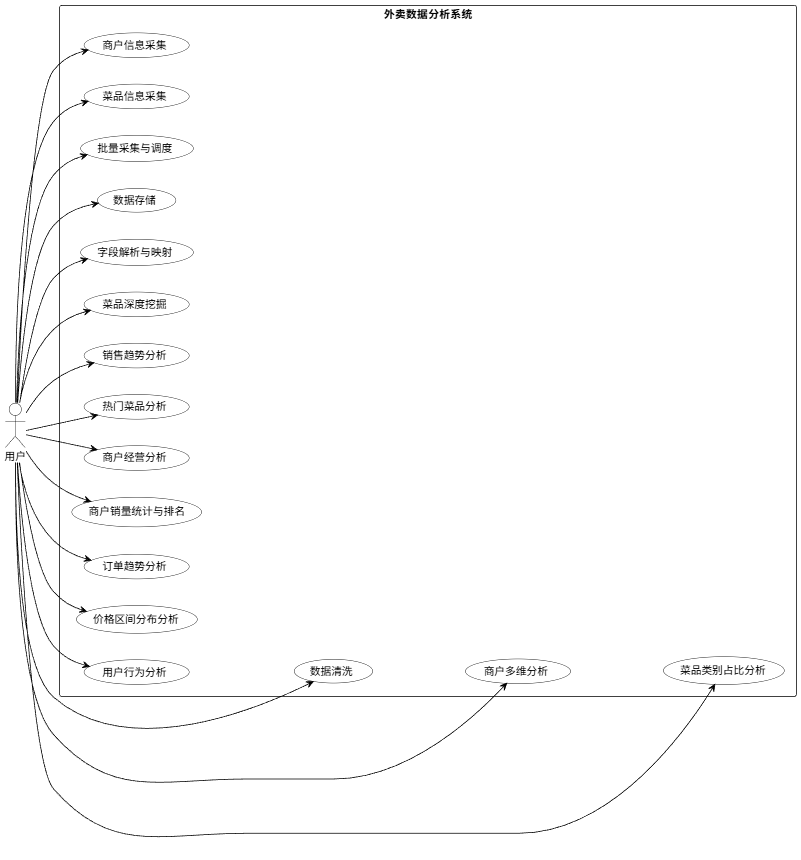

图3.1 用例图

数据清洗与入库用例描述如表3.1所示。该用例详细说明了系统如何对采集到的原始脏数据进行去空、去重及格式化处理，确保后续分析数据的准确性。

表3.1 数据清洗与入库

<table>
<tr><td>名称</td><td>数据清洗与入库</td></tr>
<tr><td>概述</td><td>对原始业务数据进行去空、去重及格式化处理，并存入数据库</td></tr>
<tr><td>参与者</td><td>用户（管理员）</td></tr>
<tr><td>前置条件</td><td>系统已获取到原始的商户或菜品 JSON/HTML 数据</td></tr>
<tr><td>步骤</td><td>活动</td></tr>
<tr><td>1</td><td>系统读取待处理的原始数据列表。</td></tr>
<tr><td>2</td><td>遍历数据，剔除关键字段（如名称、ID）为空的无效记录。</td></tr>
<tr><td>3</td><td>对数值型字段（如价格、销量）去除单位符号并转换为标准数字格式。</td></tr>
<tr><td>4</td><td>依据商户 ID 或菜品 ID 进行去重检查，防止重复入库。</td></tr>
<tr><td>5</td><td>将清洗合格的数据映射为实体对象，批量写入 MySQL 数据库。</td></tr>
<tr><td>6</td><td>系统记录清洗日志，统计成功入库条数及过滤条数。</td></tr>
</table>

商户经营多维分析可视化用例描述如表3.2所示。该用例展示了系统如何通过散点图和雷达图，从评分与销量关系、不同类型商户综合表现等维度，直观呈现商户的经营状况。

表3.2 商户经营多维分析可视化

<table>
<tr><td>名称</td><td>商户经营多维分析可视化</td></tr>
<tr><td>概述</td><td>多维度展示商户评分与销量的关联，以及不同类型商户的综合指标</td></tr>
<tr><td>参与者</td><td>用户（商家、运营人员）</td></tr>
<tr><td>前置条件</td><td>数据库中包含商户类型、评分及销量数据</td></tr>
<tr><td>步骤</td><td>活动</td></tr>
<tr><td>1</td><td>用户进入“商户经营分析”页面。</td></tr>
<tr><td>2</td><td>页面默认加载“评分与销量关系”散点图，X轴为评分，Y轴为销量。</td></tr>
<tr><td>3</td><td>用户切换 Tab 至“商户类型对比”。</td></tr>
<tr><td>4</td><td>后端计算各类型商户（如快餐、甜点）的平均评分与平均销量。</td></tr>
<tr><td>5</td><td>前端渲染雷达图，对比不同品类在各项经营指标上的强弱。</td></tr>
<tr><td>6</td><td>用户点击具体数据点，可查看该类型下的代表性商户列表。</td></tr>
</table>

菜品价格区间分布分析用例描述如表3.3所示。该用例说明了系统如何统计不同价格段的订单或菜品数量，帮助用户了解市场定价策略及消费者的价格敏感度。

表3.3 菜品价格区间分布分析

<table>
<tr><td>名称</td><td>菜品价格区间分布分析</td></tr>
<tr><td>概述</td><td>统计不同价格区间（如0-20元）的菜品数量及订单占比</td></tr>
<tr><td>参与者</td><td>用户（商家、数据分析师）</td></tr>
<tr><td>前置条件</td><td>数据库中已存在清洗完毕的菜品价格及订单数据</td></tr>
<tr><td>步骤</td><td>活动</td></tr>
<tr><td>1</td><td>用户请求查看“价格区间分布”。</td></tr>
<tr><td>2</td><td>Spark 引擎根据预设区间（如 &lt;20, 20-50, &gt;50）对数据进行分组聚合。</td></tr>
<tr><td>3</td><td>计算每个区间的菜品数量及产生的订单总数。</td></tr>
<tr><td>4</td><td>前端使用环形图展示各价格段的订单占比。</td></tr>
<tr><td>5</td><td>使用漏斗图展示从低价到高价的订单转化递减趋势。</td></tr>
<tr><td>6</td><td>用户悬停图表，显示该价格段的具体数值及百分比。</td></tr>
</table>

用户消费行为分析用例描述如表 3.4 所示。该用例阐述了系统如何基于用户的历史订单数据，分析用户的消费频次与金额偏好，从而构建用户画像，识别高价值客户。

表3.4 用户消费行为分析

<table>
<tr><td>名称</td><td>用户消费行为分析</td></tr>
<tr><td>概述</td><td>分析用户的消费频次分布及消费金额区间，识别用户价值</td></tr>
<tr><td>参与者</td><td>用户（运营人员）</td></tr>
<tr><td>前置条件</td><td>orders 表与 users 表数据关联正常</td></tr>
<tr><td>步骤</td><td>活动</td></tr>
<tr><td>1</td><td>用户进入“用户行为分析”看板。</td></tr>
<tr><td>2</td><td>系统统计每位用户的总下单次数，生成频次分布直方图。</td></tr>
<tr><td>3</td><td>用户可直观看到“下单1次”、“2-5次”、“5次以上”的用户比例。</td></tr>
<tr><td>4</td><td>切换至“消费金额”视图，系统按金额区间（如0-100元）统计用户群。</td></tr>
<tr><td>5</td><td>前端展示饼图，呈现高消费力用户的占比情况。</td></tr>
<tr><td>6</td><td>下方表格列出各区间的用户数及对平台总流水的贡献率。</td></tr>
</table>

菜品类别占比分析用例描述如表3.5所示。该用例描述了系统如何统计各菜品分类的市场份额，帮助商家优化选品结构，了解市场热门品类

表3.5       菜品类别占比分析

<table>
<tr><td>名称</td><td>菜品类别占比分析</td></tr>
<tr><td>概述</td><td>统计不同菜品分类的市场占比，分析品类热度</td></tr>
<tr><td>参与者</td><td>用户（商家、数据分析师）</td></tr>
<tr><td>前置条件</td><td>dishes 表中菜品已完成分类打标</td></tr>
<tr><td>步骤</td><td>活动</td></tr>
<tr><td>1</td><td>用户选择查看“菜品类别分析”。</td></tr>
<tr><td>2</td><td>后端服务聚合所有菜品的 category 字段，计算各分类下的菜品总数。</td></tr>
<tr><td>3</td><td>前端同时渲染饼图（展示整体占比）和柱状图（展示具体数量对比）。</td></tr>
<tr><td>4</td><td>用户点击饼图中的某一扇区（如“饮品”）。</td></tr>
<tr><td>5</td><td>柱状图联动高亮显示该分类的数据。</td></tr>
<tr><td>6</td><td>系统提供数据列表，按菜品数量降序排列各分类名称。</td></tr>
</table>

### 系统非功能需求分析

#### 性能需求

前端页面加载时间应控制在2秒以内；常规数据查询接口响应时间不超过1秒；Spark 大数据分析任务在处理百万级数据量时，应在分钟级内完成计算并返回结果。系统应支持至少50个用户同时在线访问，且在高并发情况下保持稳定，不发生服务崩溃或数据丢失。

#### 安全需求

对采集到的商户敏感信息及用户数据进行加密存储，防止数据泄露。系统后台应实施严格的身份认证与权限管理，仅授权管理员进行数据采集配置与系统维护操作。

#### 可维护性需求

系统采用前后端分离架构（Spring Boot + Vue），各模块耦合度低，便于后续功能的独立开发与维护。代码编写应遵循统一的规范，注释清晰，文档齐全，方便后续开发人员理解与接手。

### 系统可行性分析

#### 技术可行性

Spring Boot 框架成熟稳定，社区活跃，能够快速搭建高性能的 Web 服务。Vue.js 生态丰富，ECharts 图表库功能强大且易于集成，完全能够满足复杂数据可视化的需求。Apache Spark 作为业界领先的大数据计算引擎，处理海量数据效率高，且 Java API 完善，易于与 Spring Boot 集成。Jsoup 解析库简单易用，能够高效处理 HTML 文档，满足本项目对静态页面的采集需求。

综上所述，本项目所选用的技术栈均为成熟、主流的开源技术，技术风险可控，具备较高的技术可行性。

#### 经济可行性

本系统采用的所有核心技术（Spring Boot, Spark, Vue, MySQL, ECharts）均为开源免费软件，无需支付昂贵的授权费用。系统可部署在普通的云服务器或本地服务器上，硬件成本低廉。通过自动化数据采集与分析，可大幅降低人工收集整理数据的成本，提高决策效率，具有较高的投入产出比。

#### 操作可行性

系统前端界面简洁直观，交互逻辑符合用户习惯，无需经过复杂的培训即可上手操作。后台管理功能完善，管理员通过简单的配置即可完成数据采集与维护工作。可视化报表清晰易懂，能够直观地展示分析结果，辅助用户快速做出决策。

### 本章小节

本章详细分析了基于 Spark 的外卖数据分析系统的需求，从数据采集、数据管理、Spark 数据分析及可视化展示四个方面明确了系统的核心功能，并用表格形式详细描述了关键用例。

## 系统设计

### 系统架构设计

系统架构图如图4.1所示，前端展示层：基于 Vue 构建页面与路由，使用 Axios 进行网络请求；请求拦截器从本地存储读取 Token 并自动追加 Authorization: Bearer <token>，响应拦截器统一处理业务码与401未授权跳转。

（2）后端接口层：以 Spring Boot 提供 REST 接口，按业务域划分控制器，包括认证、爬虫、数据清洗、数据导入、数据分析与商户查询等模块；接口统一使用 Result 返回体封装响应码、消息与数据。

（3）业务服务层：封装业务编排与领域逻辑，典型流程包括“爬取→清洗→入库”、“文件解析→清洗→入库→导入日志”、“Spark 分析→缓存→返回图表数据”等。

（4）数据访问层：采用 MyBatis Mapper + XML 进行 SQL 映射，提供批量写入、条件查询与统计缓存读写能力；业务实体与表字段保持一一对应，便于后续扩展。

（5）安全与横切能力：通过 JWT 拦截器实现接口鉴权，除登录/刷新 Token 等白名单外其余请求均需携带有效 Token；同时配合 CORS 配置支持前后端分离部署。

（6）分析计算与缓存：Spark 通过 JDBC 加载 MySQL 表为 Data Frame，完成分组、排序等聚合统计；分析结果优先从内存缓存读取，未命中时计算并回写 analysis_results 表，异常情况下可回退读取数据库缓存结果。

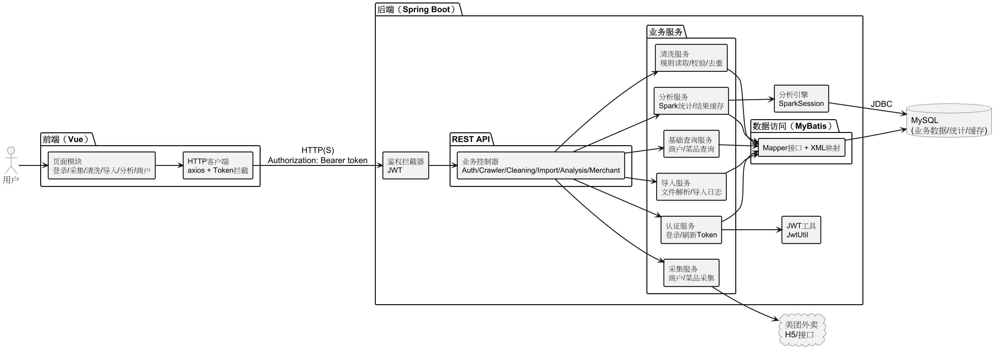

图4.1 系统总体架构图

### 功能设计

#### 用户登录功能设计

功能说明：用户在登录页输入用户名与密码，后端校验账号状态与密码密文（BCrypt），校验通过后签发 JWT，并更新最后登录时间与 IP，前端持久化 Token 以供后续请求鉴权，时序图如图4.2所示。

接口设计：POST /auth/login（请求体包含 username、password；响应返回 token 与用户信息）。

关键逻辑：

1）后端根据用户名查询系统账号表 sys_user；

2）使用 BCrypt 校验明文密码与数据库密文是否匹配；

3）检查账号状态（启用/禁用）；

4）生成 JWT（包含 username、userId、role 等声明）并回传；

5）更新最后登录时间与 IP，便于审计与运维。

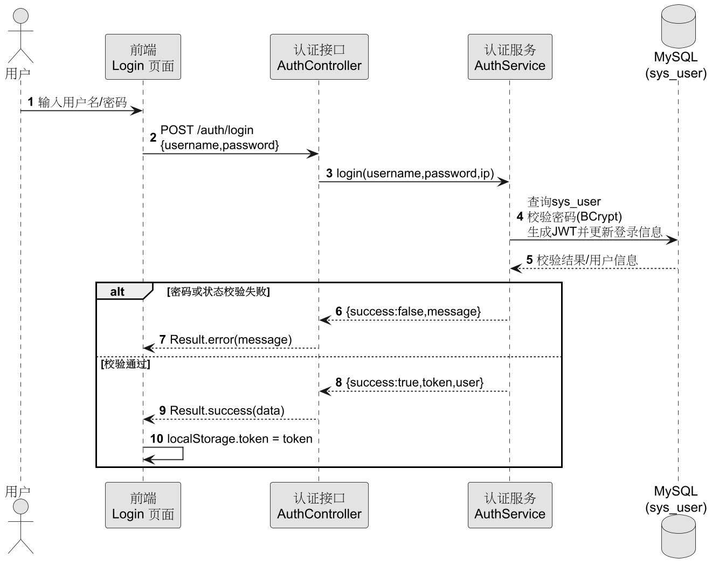

图4.2 登录时序图

#### 商户销量排名功能设计

（1）功能说明：对营业中的商户按总销量进行排序，输出 TopN 排名，为“经营表现”类图表提供数据，时序图如图4.3所示。

（2）接口设计：GET /analysis/merchant-sales?limit=（默认 limit=10）。

（3）数据来源与输出：

数据表：merchants；主要字段：merchant_id、merchant_name、total_sales、rating、status。

输出字段：merchant_id、merchant_name、total_sales、rating。

（4）处理流程：参数校验 → 生成 cacheKey → 缓存命中直接返回 → Spark 加载 merchants → status=1 过滤 → 按 total_sales 降序、limit → 结果转换与缓存回写（analysis_results）。

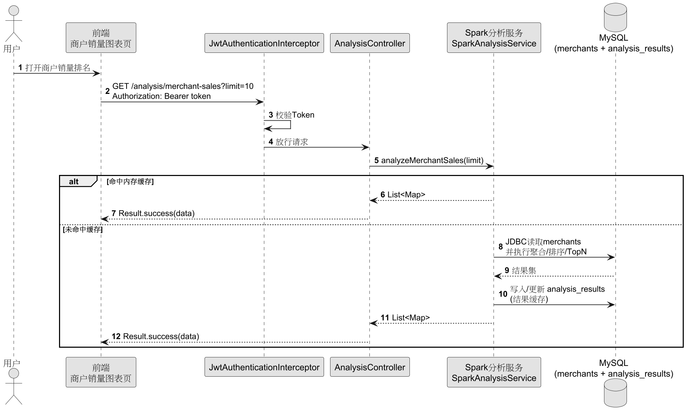

图4.3 商户销量排名时序图

#### 价格区间订单分布分析功能设计

（1）功能说明：将已支付/已完成订单按“实付金额”划分为若干价格区间，统计各区间订单数量，用于“价格结构”类分布图表。

（2）接口设计：GET /analysis/price-distribution。

（3）数据来源与输出：

数据表：orders；主要字段：order_id、actual_amount、order_status。

输出字段：price_range（0-30、30-50、50-100、100以上）与 order_count。

（4）处理流程：缓存命中直接返回→ Spark 加载 orders→ order_status IN (2,4) 过滤 →依据 actual_amount 映射 price_range →分组计数→ 缓存回写（analysis_results），时序图如图4.4所示。

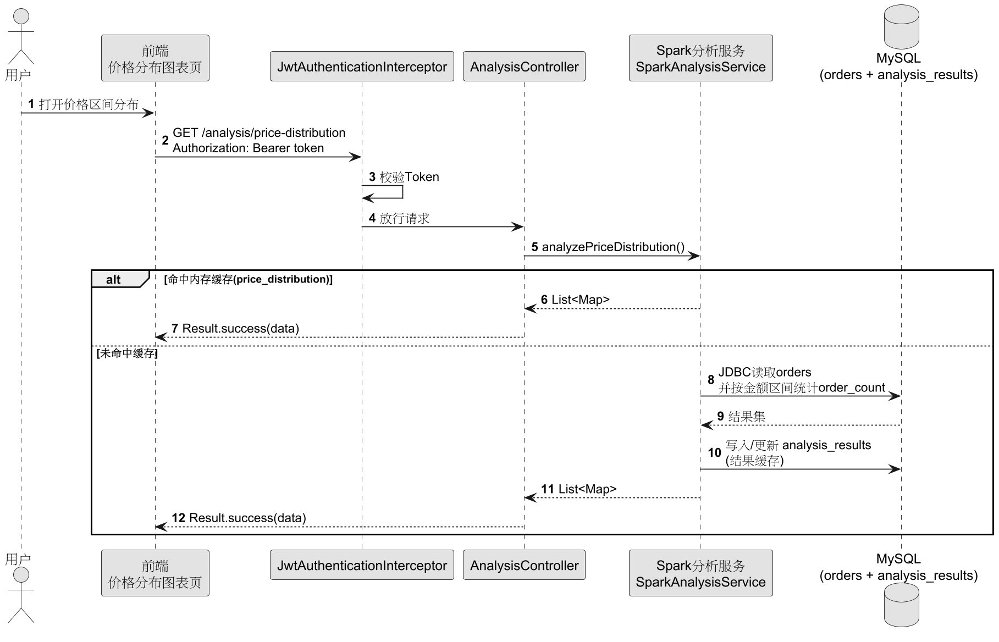

图4.4 价格区间订单分布分析功能时序图

#### 热门菜品 TopN 分析功能设计

（1）功能说明：按菜品销量输出 TopN，用于“爆款菜品”展示与运营决策参考。

（2）接口设计：GET /analysis/hot-dishes?limit=（默认 limit=10）。

（3）数据来源与输出：数据表：dishes；主要字段：dish_id、dish_name、category、sales_count、price、status；输出字段：dish_id、dish_name、category、sales_count、price。

（4）处理流程：参数校验→缓存命中直接返回→Spark加载dishes→status=1过滤 →按sales_count降序、limit →缓存回写（analysis_results），时序图如图4.5所示。

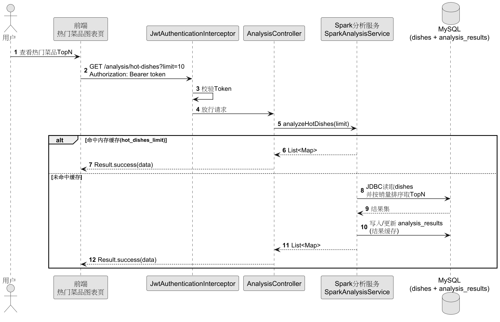

图4.5 热门菜品TopN分析时序图

#### 订单趋势分析功能设计

（1）功能说明：将已支付/已完成订单按下单日期聚合统计订单量，用于“趋势折线图/柱状图”展示。系统通过 days 参数控制返回的日期数量上限。

（2）接口设计：GET /analysis/order-trend?days=（默认 days=30）。

（3）数据来源与输出：数据表：orders；主要字段：order_time、order_id、order_status；输出字段：order_date（yyyy-MM-dd）与 order_count。

（4）处理流程：参数校验→缓存命中直接返回→ Spark加载 orders →order_status IN (2,4) 过滤→ date_format(order_time) 转日期→分组计数并按日期排序→ limit(days) 截断 →缓存回写（analysis_results），时序图如图4.6所示。

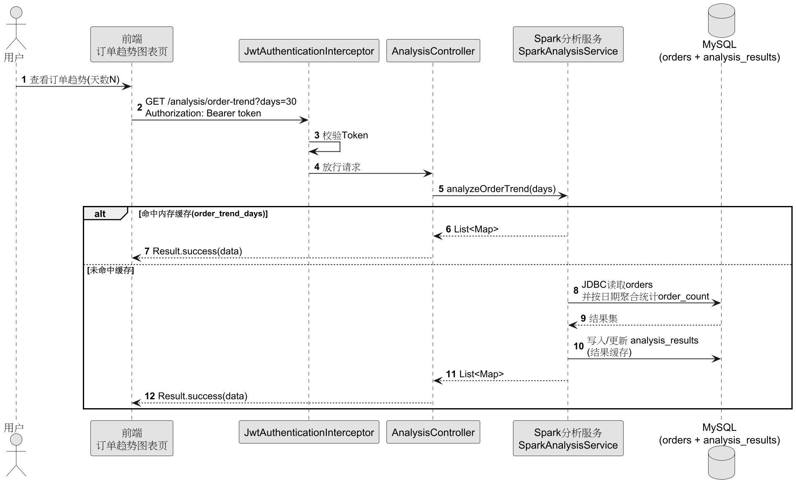

图4.6 订单趋势分析时序图

#### 菜品类别占比分析功能设计

（1）功能说明：统计在售菜品在不同类别下的数量分布，用于“类别占比/结构分析”类图表。

（2）接口设计：GET /analysis/dish-category。

（3）数据来源与输出：数据表：dishes；主要字段：category、dish_id、status；输出字段：category 与 dish_count。

（4）处理流程：缓存命中直接返回→Spark 加载 dishes→status=1 AND category IS NOT NULL过滤→按 category分组计数→按dish_count降序→缓存回写（analysis_results），时序图如图4.7所示。

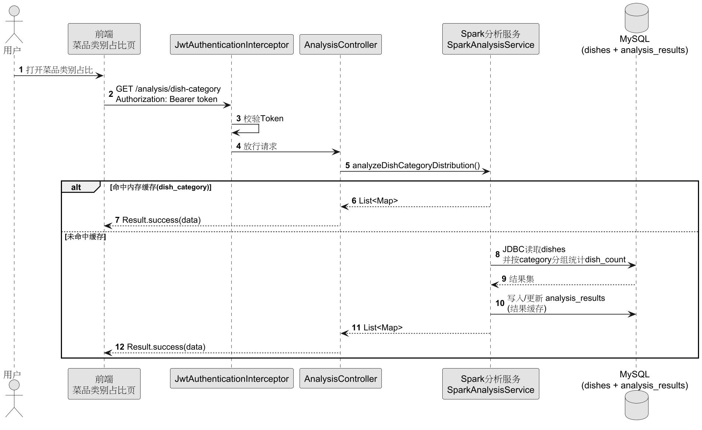

图4.7 菜品类别占比分析时序图

### 数据库设计

#### 数据库实体关系设计

本系统数据库采用 MySQL，既承载采集后的业务数据，也承载导入日志、清洗规则、统计结果缓存等数据。根据业务职责可分为四类：业务主数据（商户、菜品、用户、订单）、过程与配置数据（导入日志、清洗规则、系统账号）、统计与缓存数据（用户/商户统计表、分析结果缓存表）。数据库实体关系图如图4.8所示。

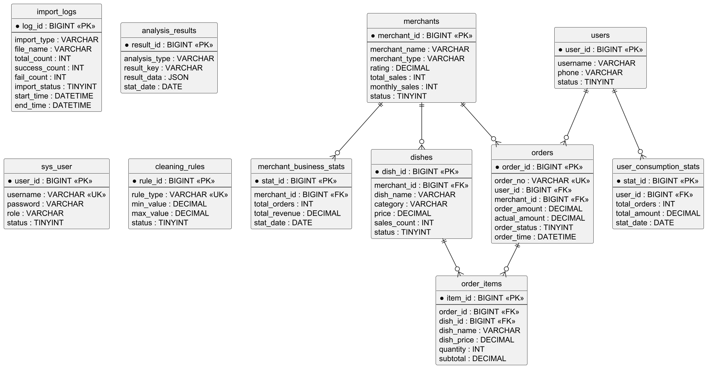

图4.8 数据库实体关系图

#### 数据库表设计

由于篇幅限制，本小章主要阐述关键表的设计：merchants商家表，dishes菜品表，users用户表，orders订单表，order_items订单明细表。

商家表结构如表4.1所示，主要存储外卖商户的基本信息和经营数据。

表4.1       商家表

<table>
<tr><td>字段名称</td><td>说明</td></tr>
<tr><td>merchant_id</td><td>商户ID（主键）</td></tr>
<tr><td>merchant_name</td><td>商户名称</td></tr>
<tr><td>merchant_type</td><td>商户类型</td></tr>
<tr><td>rating</td><td>评分（0-5分）</td></tr>
<tr><td>total_sales</td><td>总销量</td></tr>
<tr><td>monthly_sales</td><td>月销量</td></tr>
<tr><td>min_order_price</td><td>起送价</td></tr>
<tr><td>delivery_fee</td><td>配送费</td></tr>
<tr><td>address</td><td>商户地址</td></tr>
<tr><td>phone</td><td>联系电话</td></tr>
<tr><td>status</td><td>状态（营业/休息等）</td></tr>
</table>

菜品表结构如表4.2所示，主要存储菜品信息和销售数据。

表4.2       菜品表

<table>
<tr><td>字段名称</td><td>说明</td></tr>
<tr><td>dish_id</td><td>菜品ID（主键）</td></tr>
<tr><td>merchant_id</td><td>商户ID（外键）</td></tr>
<tr><td>dish_name</td><td>菜品名称</td></tr>
<tr><td>category</td><td>菜品分类</td></tr>
<tr><td>price</td><td>价格</td></tr>
<tr><td>sales_count</td><td>销量</td></tr>
<tr><td>monthly_sales</td><td>月销量</td></tr>
</table>

用户表结构如表4.3所示，主要存储用户基本信息。

表4.3       用户表

<table>
<tr><td>字段名称</td><td>说明</td></tr>
<tr><td>user_id</td><td>用户ID（主键）</td></tr>
<tr><td>username</td><td>用户名</td></tr>
<tr><td>phone</td><td>手机号</td></tr>
<tr><td>email</td><td>邮箱</td></tr>
<tr><td>gender</td><td>性别</td></tr>
<tr><td>register_time</td><td>注册时间</td></tr>
</table>

订单表结构如表4.4所示，主要存储订单主信息，支持订单趋势分析。

表4.4       订单表

<table>
<tr><td>字段名称</td><td>说明</td></tr>
<tr><td>order_id</td><td>订单ID（主键）</td></tr>
<tr><td>order_no</td><td>订单编号（唯一）</td></tr>
<tr><td>user_id</td><td>用户ID（外键）</td></tr>
<tr><td>merchant_id</td><td>商户ID（外键）</td></tr>
<tr><td>order_amount</td><td>订单金额</td></tr>
<tr><td>actual_amount</td><td>实付金额</td></tr>
<tr><td>order_status</td><td>订单状态</td></tr>
<tr><td>order_time</td><td>下单时间</td></tr>
</table>

订单明细表结构如表4.5所示，主要存储订单中的菜品明细，支持热门菜品分析。

表4.5       订单明细表

<table>
<tr><td>字段名称</td><td>说明</td></tr>
<tr><td>item_id</td><td>明细ID（主键）</td></tr>
<tr><td>order_id</td><td>订单ID（外键）</td></tr>
<tr><td>dish_id</td><td>菜品ID（外键）</td></tr>
<tr><td>dish_name</td><td>菜品名称（冗余字段）</td></tr>
<tr><td>dish_price</td><td>菜品单价（冗余字段）</td></tr>
<tr><td>quantity</td><td>数量</td></tr>
<tr><td>subtotal</td><td>小计金额</td></tr>
</table>

### 本章小结

本章节主要阐述系统架构设计，系统采用前后端分离与分层架构，后端以 JWT 鉴权提供采集、清洗、导入与查询接口，分析模块基于 Spark通过 JDBC 计算并缓存结果。

## 系统实现

### 登录实现

本系统采用前后端分离架构，登录功能通过 JWT (JSON Web Token) 技术实现无状态认证。前端使用 Vue.js 构建登录界面，通过 Axios 发送异步请求将用户输入的用户名和密码提交至后端。后端 Spring Boot 接收请求后，利用 Spring Security 的加密机制验证用户身份。验证通过后，服务器生成包含用户 ID、角色等信息的 JWT Token 并返回给前端。前端将 Token 存储在 LocalStorage 中，并在后续的所有 HTTP 请求头中自动携带该 Token，以实现身份的持久化验证。登录界面的实现效果如图5.1所示。

图5.1 登录

关键代码逻辑主要集中在后端的 AuthServiceImpl 类中。系统根据用户名查询数据库中的用户信息，如果用户不存在则抛出异常。使用 BCryptPasswordEncoder 对比用户输入的密码与数据库中存储的加密密码是否匹配。若匹配成功，则调用 JwtUtil 工具类生成 Token，并将用户信息一并封装返回。以下是登录验证的核心代码：

@Override

public Map<String, Object> login(String username, String password, String ip) {

// 1. 查询用户

SysUser user = sysUserMapper.selectByUsername(username);

if (user == null) {

throw new RuntimeException("用户不存在");

}

// 2. 验证密码 (使用BCrypt加密)

if (!passwordEncoder.matches(password, user.getPassword())) {

throw new RuntimeException("密码错误");

}

// 3. 生成JWT Token

String token = jwtUtil.generateToken(user.getUsername(), user.getUserId(), user.getRole());

// 4. 更新最后登录时间和IP

sysUserMapper.updateLastLogin(user.getUserId(), LocalDateTime.now(), ip);

// 5. 返回结果

Map<String, Object> result = new HashMap<>();

result.put("token", token);

result.put("user", user);

return result;

}

### 数据统计实现

前端页面采用栅格布局，顶部展示商户总数、订单总数、用户数等关键指标的统计卡片，下方通过集成 V-Charts 图表库展示订单趋势折线图等。页面加载时，Vue 组件的 mounted 生命周期钩子会并行发起多个 API 请求，获取各类统计数据，利用 Vue 的响应式特性将数据实时渲染到界面上，实现了数据的动态可视化展示。数据统计首页的实现效果如图5.2所示。

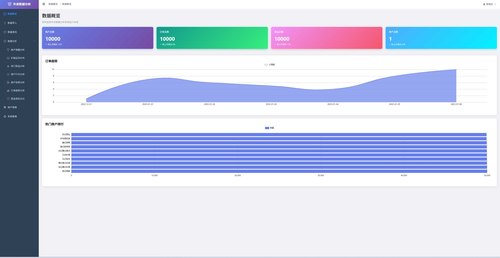

图5.2 数据统计

关键代码逻辑位于前端 dashboard/index.vue 组件中。通过配置 orderTrendSettings 和 pieSettings 对象来定义图表的样式和交互行为，例如开启面积图模式和设置自定义配色。数据加载函数 loadData 负责调用后端接口并将返回的数据映射到图表所需的格式中。以下是前端图表配置的关键代码：

data() {

return {

// 订单趋势图配置

orderTrendData: {

columns: ['日期', '订单数'],

rows: [] // 数据通过API动态加载

},

orderTrendSettings: {

area: true // 开启面积图模式

}

}

},

methods: {

async loadData() {

// 加载订单趋势数据

const trendRes = await analysisApi.getOrderTrend(7)

if (trendRes.data) {

this.orderTrendData.rows = trendRes.data.map(item => ({

日期: item.order_date,

订单数: item.order_count

}))

}

}

}

### 商户管理实现

商户管理模块实现了对平台入驻商户信息的查询、筛选与展示。前端使用 Element UI 的 Table 组件构建列表，支持分页显示和按商户类型（如中餐、西餐等）进行条件筛选。后端 Controller 接收查询参数，通过 MyBatis 执行动态 SQL 查询数据库，返回符合条件的商户列表及总记录数。此外，列表页还提供了查看详情的入口，方便管理员通过弹窗或跳转方式查看商户的具体运营数据。商户列表页面的实现效果如图5.3所示。

图5.3 商户列表

### 商户销量统计与排名实现

本模块利用 Spark 强大的计算引擎对海量商户数据进行离线分析。Spark 作业读取商户表数据，根据总销量字段进行降序排序，并截取前 N 名（Top 10/20/50）作为热门商户。为了提高系统响应速度，分析结果会被缓存到 Redis 或数据库的结果表中。前端页面通过柱状图直观展示排名情况，并配以详细的数据表格，支持用户动态切换显示的排名数量。商户销量统计与排名的实现效果如图5.4所示。

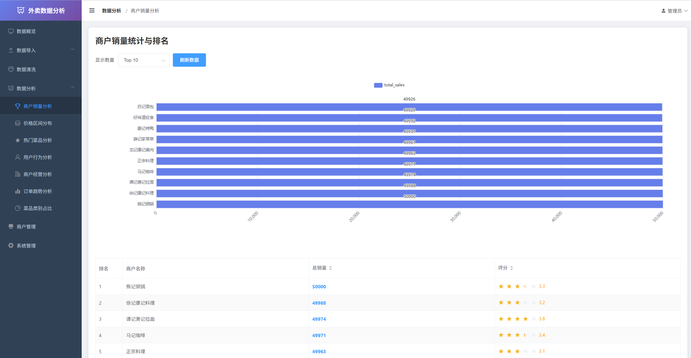

图5.4 商户销量统计与排名

关键代码逻辑位于 SparkAnalysisServiceImpl 类中。通过 Spark SQL 的 Dataset API 加载商户数据，利用 orderBy 和 desc 算子实现全量数据的排序，再通过 limit 算子提取头部数据。计算结果被转换为 Map 列表格式返回给前端。以下是基于 Spark 的销量分析核心代码。

@Override

public List<Map<String, Object>> analyzeMerchantSales(int limit) {

// 1. 加载商户数据

Dataset<Row> merchants = loadTable("merchants");

// 2. Spark SQL 分析逻辑

Dataset<Row> result = merchants

.select("merchant_id", "merchant_name", "total_sales", "rating")

.filter("status = 1") // 过滤有效商户

.orderBy(functions.desc("total_sales")) // 按销量降序

.limit(limit); // 取前N名

// 3. 转换结果并缓存

List<Map<String, Object>> data = convertToMapList(result);

saveToCache("merchant_sales_" + limit, data, "merchant_sales");

return data;

}

### 价格区间订单分布实现

为了分析用户的消费水平，系统实现了订单价格区间的分布统计。Spark 后端对订单表中的实际支付金额进行分桶处理，将其划分为“0-30元”、“30-50元”等若干个价格区间。前端页面采用多图表联动的方式，同时展示环形图（显示各区间占比）、柱状图（显示各区间订单量）和漏斗图（显示数据层级），从而全方位地展示订单价格分布特征。价格区间订单分布的实现效果如图5.5所示。

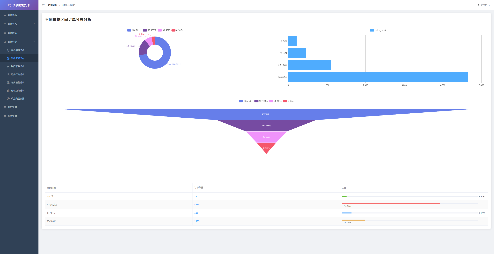

图5.5 价格区间订单分布

关键代码逻辑使用了 Spark SQL 的 when().otherwise() 语法来实现数据的条件分桶。通过 groupBy 对分桶后的字段进行分组，并使用 count 聚合函数统计每个区间的订单数量。这种处理方式能够将连续的金额数据转化为离散的区间统计数据。以下是价格区间分析的关键代码。

@Override

public List<Map<String, Object>> analyzePriceDistribution() {

Dataset<Row> orders = loadTable("orders");

Dataset<Row> result = orders

.filter("order_status IN (2, 4)") // 筛选有效订单

.select(

// 使用 when-otherwise 进行数据分桶

functions.when(functions.col("actual_amount").lt(30), "0-30元")

.when(functions.col("actual_amount").lt(50), "30-50元")

.when(functions.col("actual_amount").lt(100), "50-100元")

.otherwise("100元以上")

.as("price_range"),

functions.col("order_id")

)

.groupBy("price_range") // 按区间分组

.agg(functions.count("order_id").as("order_count")); // 统计数量

return convertToMapList(result);

}

### 热门菜品分析实现

该功能旨在挖掘平台上的爆款菜品。系统通过 Spark 对菜品表中的历史销量数据进行分析，识别出销量最高的菜品列表。前端采用横向条形图（Bar Chart）进行展示，横向布局更适合展示名称较长的菜品标签，同时使用鲜艳的颜色突出销量数据，帮助商家和平台运营者快速识别受大众欢迎的菜品。热门菜品分析的实现效果如图5.6所示。

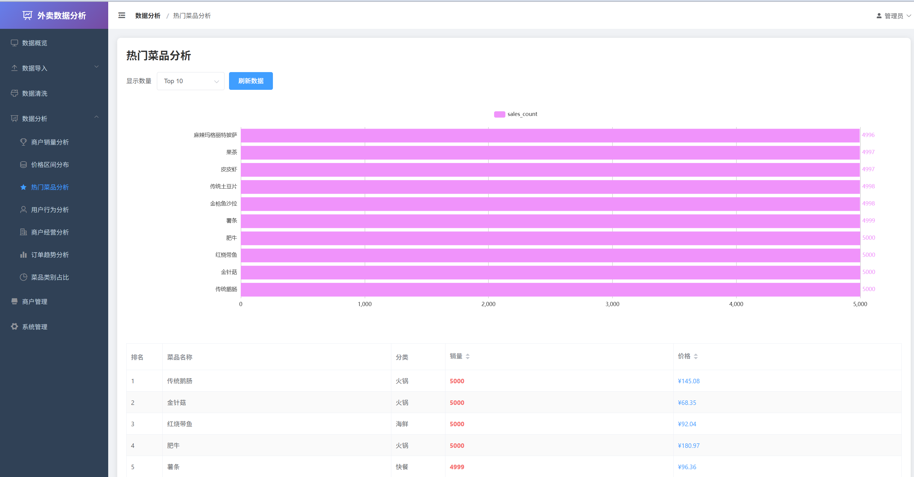

图5.6 热门菜品分析

### 用户行为分析实现

用户行为分析模块从消费频次和消费金额两个维度构建用户画像。系统利用 Spark 对用户的历史订单数据进行聚合统计，将用户划分为不同的活跃度等级（如低频、中频、高频）和消费层级。前端页面通过 Tab 标签页切换不同的分析视图，分别使用直方图和饼图展示用户在频次和金额上的分布情况，直观反映平台用户的粘性和价值分布。用户行为分析的实现效果如图5.7所示。

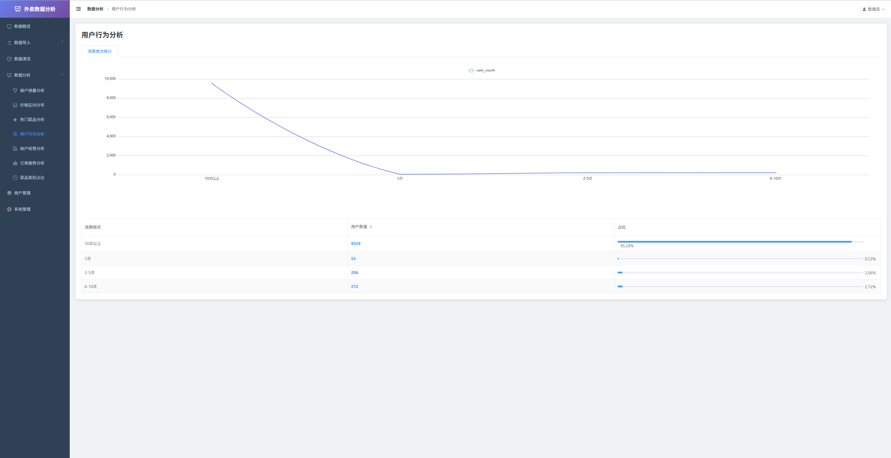

图5.7 用户行文分析

关键代码逻辑中，Spark 使用了复杂的 SQL 逻辑对用户消费统计表进行二次聚合。例如，在分析消费频次时，根据 total_orders 字段的值域将用户归类到不同的频次区间，然后统计每个区间内的用户数量。以下是用户消费频次分析的关键代码。

@Override

public List<Map<String, Object>> analyzeUserConsumptionFrequency() {

Dataset<Row> userStats = loadTable("user_consumption_stats");

Dataset<Row> result = userStats

.select(

functions.when(functions.col("total_orders").equalTo(1), "1次")

.when(functions.col("total_orders").leq(5), "2-5次")

.when(functions.col("total_orders").leq(10), "6-10次")

.otherwise("10次以上")

.as("frequency_range"),

functions.col("user_id")

)

.groupBy("frequency_range")

.agg(functions.count("user_id").as("user_count"));

return convertToMapList(result);

}

### 商户经营分析实现

商户经营分析模块提供了深度的多维数据洞察。一方面，通过散点图分析商户评分与销量的相关性，探索口碑对经营的影响；另一方面，通过雷达图对比不同餐饮品类（如快餐、火锅）在平均评分、总销量、商户数量等维度的表现。前端页面集成了这两种高级图表，帮助分析人员发现不同类型商户的经营优劣势。商户经营分析的实现效果如图5.8所示。

图5.7 商户经营分析

关键代码逻辑涉及多表数据的聚合与多指标计算。在商户类型对比分析中，Spark 对 merchants 表按 merchant_type 分组，同时计算评分平均值（avg）、销量总和（sum）和商户计数（count）。前端雷达图配置则需要定义多个指标维度。以下是商户类型对比分析的关键代码。

@Override

public List<Map<String, Object>> analyzeMerchantTypeComparison() {

Dataset<Row> merchants = loadTable("merchants");

Dataset<Row> result = merchants

.filter("status = 1 AND merchant_type IS NOT NULL")

.groupBy("merchant_type")

.agg(

functions.avg("rating").as("avg_rating"),     // 平均评分

functions.sum("total_sales").as("total_sales"), // 总销量

functions.count("merchant_id").as("merchant_count") // 商户数量

)

.orderBy(functions.desc("total_sales"));

return convertToMapList(result);

}

### 订单趋势分析实现

订单趋势分析模块用于监控平台业务的时间变化规律。后端接收前端传递的时间范围参数（如最近7天、30天），Spark 将订单时间格式化为日期，并按日分组统计订单量。前端使用面积折线图展示趋势走向，并在数据表格中通过对比前后两日的订单量，自动计算并显示“上升”或“下降”的趋势图标，提供了直观的数据波动反馈。订单趋势分析的实现效果如图5.9所示。

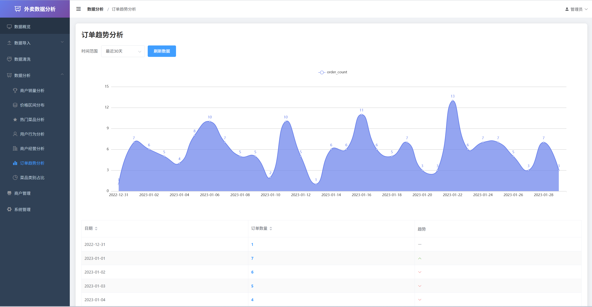

图5.9 订单趋势分析

关键代码逻辑包含后端的日期格式化分组和前端的趋势计算。后端利用 date_format 函数处理时间字段，前端在处理表格数据时，遍历数组对比相邻元素的数值大小，动态生成趋势标记。以下是后端日期分组统计的关键代码。

public List<Map<String, Object>> analyzeOrderTrend(int days) {

Dataset<Row> orders = loadTable("orders");

Dataset<Row> result = orders

.filter("order_status IN (2, 4)")

.select(

// 格式化日期为 yyyy-MM-dd

functions.date_format(functions.col("order_time"), "yyyy-MM-dd").as("order_date"),

functions.col("order_id")

)

.groupBy("order_date")

.agg(functions.count("order_id").as("order_count"))

.orderBy("order_date")

.limit(days);

return convertToMapList(result);

}

### 菜品类别占比分析实现

为了解市场对不同菜品类别的需求结构，系统实现了菜品类别占比分析。Spark 对全量菜品数据按类别进行聚合统计。前端页面组合使用了饼图和环形图两种圆环类图表，并配合带有进度条的表格，清晰展示了各菜品类别的市场份额。不同的颜色编码使得各类别的占比一目了然，辅助商家优化菜品结构。菜品类别占比分析的实现效果如图5.10所示。

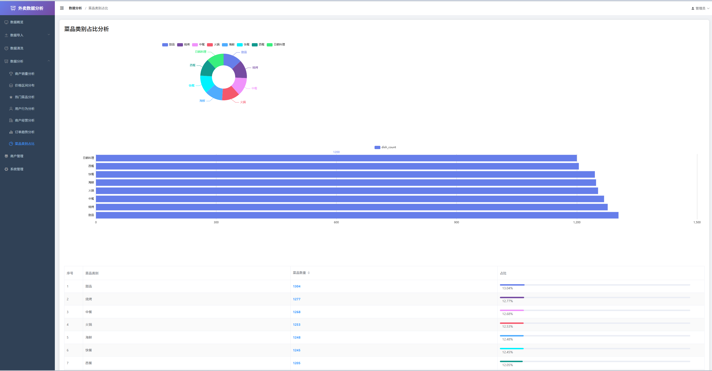

图5.10 菜品类别占比分析

关键代码逻辑相对简洁，主要涉及对 category 字段的分组统计。前端部分通过 getProgressColor 方法实现了动态颜色分配，使得表格中的进度条颜色与图表保持一致，增强了视觉的统一性。以下是后端类别统计的关键代码。

@Override

public List<Map<String, Object>> analyzeDishCategoryDistribution() {

Dataset<Row> dishes = loadTable("dishes");

Dataset<Row> result = dishes

.filter("status = 1 AND category IS NOT NULL")

.groupBy("category")

.agg(functions.count("dish_id").as("dish_count"))

.orderBy(functions.desc("dish_count"));

return convertToMapList(result);

}

### 本章小结

本章详细阐述了基于 Spark 的外卖数据分析系统的具体实现过程。从基础的 JWT 安全登录模块，到核心的商户管理与多维度数据分析功能，系统充分利用了 Spark 的大数据处理能力和 Vue 的前端渲染优势。通过对商户销量、订单趋势、用户行为及菜品类别等关键指标的深入分析与可视化展示，系统成功实现了从数据到底层价值的转化，为平台运营决策提供了强有力的技术支撑。所有功能模块均已通过测试并达到预期效果。

## 系统测试

### 测试方法

测试在本地开发环境完成，前后端分离部署，数据库与分析引擎按项目配置启动。关键环境与组件如下。

（1）操作系统：Windows 64 位（本地开发机）。

（2）后端运行环境：JDK 11；Spring Boot 2.7.14；Maven 构建。

（3）前端运行环境：Node.js（用于 Vue2 项目本地启动）；Vue 2.6.x；Element UI；axios。

（4）数据库与连接：MySQL 8.0（测试库 takeaway_analysis），数据表由初始化脚本创建并导入基础数据；后端通过 MyBatis + Druid 连接池访问数据库。

（5）分析计算：Spark 3.2.0，local[*] 本地模式运行，按需从 MySQL 读取业务表进行聚合统计，返回图表所需数据结构。

（6）访问方式与工具：浏览器（Chrome/Edge）进行页面操作；Postman/Apifox 用于接口调试与鉴权验证。

测试方法采用黑盒测试为主、接口验证为辅的方法开展测试。

（1）功能测试：以用户视角在前端页面执行“登录—访问页面—加载数据”的主流程，观察页面路由跳转、提示信息与图表/表格渲染结果。

（2）接口测试：通过接口工具直接调用后端接口，验证登录接口是否能正确签发 Token、受保护接口是否会对未携带 Token 的请求返回未授权响应。

（3）判定标准：实际运行结果与期望结果一致判定为“通过”；否则判定为“失败”并记录现象与复现步骤。

说明：系统采用 JWT 作为鉴权方式，前端请求拦截器会自动在请求头中携带 Authorization: Bearer <token>；后端对除 /auth/login、/auth/refresh 等白名单接口外的请求均进行拦截校验。系统当前未开放“自助注册”接口，测试中的“注册”以初始化脚本/数据库创建账号的方式进行验证。

### 测试用例

#### 商品销量TopN测试

对营业中的商户按总销量进行排序，输出 TopN 排名，测试用例如表6.1所示。

表6.1 商品销量TopN测试用例表

<table>
<tr><td>用例编号</td><td>用例名称</td><td>前置条件</td><td>测试步骤/输入数据</td><td>预期结果</td></tr>
<tr><td>TC-MS-01</td><td>默认查询 Top10 商户</td><td>数据库存在 &gt;10 家营业商户，且销量不同</td><td>1. 调用接口 /analysis/merchant-sales 2. 不传 limit 参数</td><td>1. 返回状态码 200 2. 返回列表长度为 10 3. 列表按 total_sales 降序排列</td></tr>
<tr><td>TC-MS-02</td><td>自定义查询 Top5 商户</td><td>数据库存在 &gt;5 家营业商户</td><td>调用接口 /analysis/merchant-sales?limit=5</td><td>1. 返回状态码 200 2. 返回列表长度为 5 3. 数据按销量降序排列</td></tr>
<tr><td>TC-MS-03</td><td>过滤非营业商户</td><td>存在销量很高但 status=0 的商户</td><td>调用接口查询并检查返回列表</td><td>返回列表仅包含 status=1 的商户</td></tr>
<tr><td>TC-MS-04</td><td>数据不足 Limit 数量</td><td>营业商户总数仅 3 家，请求 limit=10</td><td>调用接口 /analysis/merchant-sales?limit=10</td><td>1. 返回状态码 200 2. 返回列表长度为 3 3. 不报错</td></tr>
<tr><td>TC-MS-05</td><td>缓存命中测试</td><td>Redis 中已存在缓存数据</td><td>1. 第一次调用接口 2. 修改数据库销量 3. 再次立即调用接口</td><td>第二次数据与第一次一致，响应更快</td></tr>
</table>

#### 价格区间分布测试

统计已支付/已完成订单在不同实付金额区间（0-30, 30-50 等）的数量，测试用例如表6.2所示。

表6.2 价格区间分布测试用例表

<table>
<tr><td>用例编号</td><td>用例名称</td><td>前置条件</td><td>测试步骤/输入数据</td><td>预期结果</td></tr>
<tr><td>TC-PD-01</td><td>正常区间分布统计</td><td>存在不同金额订单数据</td><td>调用接口 /analysis/price-distribution</td><td>返回 4 个区间对象，各区间统计正确</td></tr>
<tr><td>TC-PD-02</td><td>订单状态过滤测试</td><td>存在待支付和已取消订单</td><td>调用接口查询</td><td>仅统计 order_status=2,4 的订单</td></tr>
<tr><td>TC-PD-03</td><td>边界值划分测试</td><td>存在金额为 30,50,100 的订单</td><td>插入边界值订单后调用接口</td><td>边界值不丢失、不重复，区间划分正确</td></tr>
<tr><td>TC-PD-04</td><td>无有效订单数据</td><td>数据库无有效订单</td><td>调用接口</td><td>返回各区间 order_count=0</td></tr>
</table>

#### 热门菜品TopN测试

按菜品销量降序输出 TopN 菜品，测试用例如表6.3所示。

表6.3 热门菜品TopN测试用例表

<table>
<tr><td>用例编号</td><td>用例名称</td><td>前置条件</td><td>测试步骤/输入数据</td><td>预期结果</td></tr>
<tr><td>TC-HD-01</td><td>默认查询热门菜品</td><td>存在 &gt;10 个上架菜品</td><td>调用接口 /analysis/hot-dishes</td><td>返回 10 条数据，按 sales_count 降序</td></tr>
<tr><td>TC-HD-02</td><td>过滤下架菜品</td><td>某高销量菜品 status=0</td><td>调用接口查询</td><td>返回结果不包含下架菜品</td></tr>
<tr><td>TC-HD-03</td><td>参数 Limit 校验</td><td>传入非法 limit 参数</td><td>调用 /analysis/hot-dishes?limit=abc 或 -1</td><td>返回 400 或默认值 10（建议 400）</td></tr>
<tr><td>TC-HD-04</td><td>销量相同排序</td><td>存在多个销量相同菜品</td><td>构造相同销量数据后调用接口</td><td>排序稳定，符合二级排序规则</td></tr>
</table>

#### 订单趋势分析测试

按日期聚合统计订单量，支持指定天数，测试用例如表6.4所示。

表6.4 订单趋势分析测试用例表

<table>
<tr><td>用例编号</td><td>用例名称</td><td>前置条件</td><td>测试步骤/输入数据</td><td>预期结果</td></tr>
<tr><td>TC-OT-01</td><td>默认 30 天趋势</td><td>近 30 天有订单数据</td><td>调用接口 /analysis/order-trend</td><td>返回不超过 30 条数据，统计准确</td></tr>
<tr><td>TC-OT-02</td><td>自定义天数查询</td><td>存在历史订单数据</td><td>调用 /analysis/order-trend?days=7</td><td>返回最近 7 天数据</td></tr>
<tr><td>TC-OT-03</td><td>日期格式验证</td><td>正常订单数据</td><td>检查 order_date 字段</td><td>格式为 yyyy-MM-dd</td></tr>
<tr><td>TC-OT-04</td><td>无数据日期填充</td><td>某天无订单数据</td><td>调用接口查询</td><td>按需求决定是否补 0</td></tr>
<tr><td>TC-OT-05</td><td>状态过滤一致性</td><td>存在大量未支付订单</td><td>调用接口</td><td>仅统计 status=2,4 订单</td></tr>
</table>

### 本章小结

本章对系统进行了硬件与软件模块的黑盒测试，分别设计了详细的测试用例。通过验证各个功能模块的正常运行，确保了系统的稳定性和可靠性。

## 结论

随着大数据技术的飞速发展，如何从海量、杂乱的外卖业务数据中挖掘出有价值的信息，已成为提升外卖平台服务质量和商家运营效率的关键。本文针对外卖行业数据分析的需求，设计并实现了一套基于Spark的外卖数据分析系统，完成了从数据采集、清洗、存储到深度分析及可视化的全过程。本文的主要研究成果及结论总结如下：

构建了完整的数据处理全链路架构：系统成功整合了多种技术栈，构建了前后端分离的Web应用。后端采用Spring Boot框架保证了系统的稳定性与扩展性，前端利用Vue.js提供了良好的用户交互体验。同时，利用Jsoup技术实现了对美团外卖平台数据的定向采集，并通过清洗算法解决了数据来源分散、格式非结构化的问题，最终将规范化数据持久化存储于MySQL中，为后续分析奠定了坚实基础。

验证了Spark在大规模数据处理中的优势 ：核心分析模块引入Apache Spark计算框架，针对海量商户和订单数据进行了多维度的并行计算。实践证明，Spark在处理商户销量排名、热门菜品挖掘及价格区间分布等高计算量任务时，表现出了良好的计算性能和吞吐量，有效解决了传统单机分析方式在面对大规模数据时的瓶颈问题。

实现了数据价值的直观转化：通过ECharts图表库将复杂的分析结果转化为柱状图、饼图、折线图等直观的可视化报表。这些报表不仅能够清晰地展示市场动态和用户消费偏好（如通过用户行为分析辅助精准营销），还为商家的菜品定价、营销策略调整以及平台的监管提供了客观的数据支撑，验证了系统在商业智能层面的实用价值。

尽管本系统已实现了预期的主要功能，但受限于时间和客观条件，仍存在一些不足之处。例如，目前数据采集主要针对单一平台，未来可扩展至饿了么等更多平台以提升数据的全面性；其次，系统目前主要基于离线数据进行批处理分析，未来可以引入Spark Streaming技术，实现对交易数据的实时监控与分析，进一步提升系统的时效性和应用广度。
